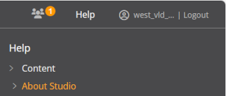
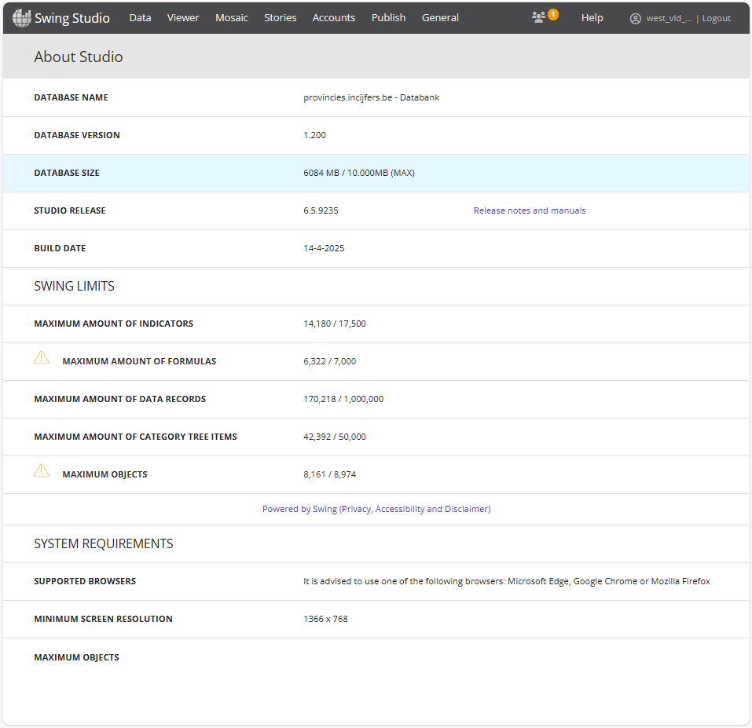
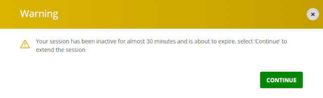
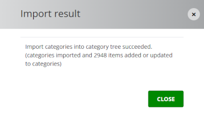
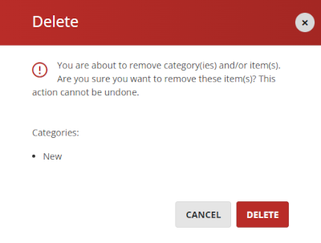
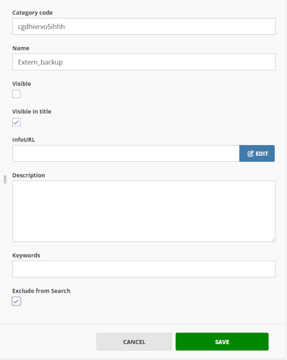

# Themaboom gelijkzetten met PinC

## Inleiding

Voortaan heb je als centrumstad de mogelijkheid om je themaboom gelijk te zetten met de themaboom van PinC. Je hoeft dit script niet zelf te runnen: het script wordt op regelmatige basis gerund door de beheerders van PinC. Het script produceert een meerdere Excel-bestanden, die met de centrumsteden gedeeld kunnen worden via GitHub.

Wil je als centrumstad je themaboom gelijkzetten met de themaboom van PinC, dan zul je in de nabije toekomst hiervan gebruik kunnen maken. Je hoeft dit script niet zelf te runnen: het script zal op regelmatige basis gerund worden door de beheerders van PinC. Het script produceert een Excel-bestand, dat met de centrumsteden gedeeld kan worden via GitHub. Wil je als centrumstad je themaboom gelijkzetten met PinC, dan kun je dat Excel-bestand importeren. Het bestand bevat een selectie van de externe themaboom van PinC, met alle thema’s, subthema’s en onderwerpen in dezelfde volgorde als op PinC. De selectie bevat alleen de onderwerpen die gedeeld worden via de connector.

Er wordt een groot Excel-bestand aangemaakt met de complete themaboom (d.w.z. alle onderwerpen die gedeeld worden via de connector). Daarnaast worden er een aantal kleinere Exce-bestanden aangemaakt: één voor elk hoofdthema (DEMOGRAFIE, ONDERWIJS, etc.). Zo heb je de keuze en kun je kiezen of je alles gelijk wilt zetten of enkel één of meerdere thema’s.

Wil je als centrumstad je themaboom gelijkzetten met PinC, dan kun je dat Excel-bestand importeren. Het bestand bevat een selectie van de externe themaboom van PinC, met alle thema’s, subthema’s en onderwerpen in dezelfde volgorde als op PinC. De selectie bevat alleen de onderwerpen die gedeeld worden via de connector.

Let op: een grote themaboom importeren kan erg lang duren. Wil je dit eerst gewoon even uitproberen om te zien hoe het werkt, begin dan met één thema (met een veel kleiner Excel-bestand).

Je moet er ook rekening mee houden dat elke Swing-implementatie zijn eigen limieten heeft voor wat betreft het aantal items in de themaboom. Als je een groot themaboom-bestand importeert, dan moet je eerst zeker zijn dat de limiet door de import niet bereikt of overschreden zal worden.

Je kunt de limieten die van toepassing zijn op jouw Swing-omgeving controleren door in te loggen in Swing Studio en vervolgens in het menu rechtsboven `Help` en daarna `About Studio` te kiezen.

Je krijgt dan een overzichtspagina te zien. Bij provincies.incijfers.be ziet die pagina er bijvoorbeeld als volgt uit (april 2025):

Voor de themaboom is de limiet ‘maximum amount of category tree items’ van belang. Hierbij moet onder ‘items’ niet alleen de onderwerpen verstaan worden, maar ook alle benodigde mappen en submappen (thema’s en subthema’s).

## Werking van het script

Om het script te laten werken, moeten we eerst de volledige (externe + interne) themaboom van PinC exporteren. We krijgen dan een exportbestand genaamd `CategoryTree.xlsx`, dat we in dezelfde map plaatsen als het script.

Vervolgens wordt het script gerund. Het resultaat is een nieuw Excel-bestand met de naam `CategoryTree_import_PinC.xlsx`. Dat bestand kan (in theorie) in de Swing-omgevingen van de centrumsteden geïmporteerd worden (zolang daarbij de limiet ‘maximum amount of category tree items’ niet overschreden dreigt te worden).

Dat bestand bevat de volledige themaboom; daarnaast worden ook meerdere kleinere Excel-bestanden aangemaakt per hoofdthema, bv.:

`CategoryTree_import_PinC_DEMOGRAFIE.xlsx`\
`CategoryTree_import_PinC_ONDERWIJS.xlsx`\
`CategoryTree_import_PinC_WERKEN_EN_ONDERNEMEN.xlsx`\
...

Om dit voor elkaar te krijgen gaat het script als volgt te werk:

Het script maakt eerst een lijst van alle onderwerpen die in de **connector** zitten. De connector-onderwerpen bevinden zich in de interne themaboom van PinC, onder Swing Connectoren > Uitgaande connectoren > Centumsteden > Swing Connector Centrumsteden. (Ja, we hebben het ook gemerkt: er ontbreekt een ‘r’ in ‘Centumsteden’...) Alleen die onderwerpen komen in aanmerking om in het resulterende Excel-bestand opgenomen te worden.

Het script overloopt vervolgens alle items in de **externe themaboom** van PinC, in volgorde. Enkel de onderwerpen die ook in de connector zitten, worden behouden; al de rest wordt verwijderd.

Het resultaat is een subset van de externe themaboom van PinC, waarin alleen de connector-onderwerpen voorkomen en waarbij de volgorde van de externe themaboom van PinC behouden blijft.

Om dit te kunnen importeren bij de centrumsteden, moeten we wel nog de indicatorcodes wijzigen: alle codes die via de uitgaande connector gaan, krijgen bij de centrumsteden immers het prefix `dna_`. Het script zal daarom overal dat prefix toevoegen, zodat de codes overeenstemmen met de codes in de databank van de Swing-omgeving van de centrumsteden.

Momenteel (april 2025) worden er meer dan 10.630 items uit de externe themaboom van PinC (voornamelijk onderwerpen, maar ook enkele rapporten) gedeeld via de connector.

## Import

Het is natuurlijk niet de bedoeling dat de (externe) themaboom van de centrumsteden zomaar wordt overschreven wanneer het bestand wordt geïmporteerd.

> _De bestaande themaboom overschrijven met een nieuwe is overigens niet zomaar mogelijk: met een importbestand kunnen alleen maar nieuwe items toegevoegd worden en bestaande items vervangen worden, maar er kunnen met een import nooit bestaande items verwijderd of verplaatst worden._

Daarom staan alle te importeren onderwerpen aanvankelijk onder een tijdelijke map, die je kunt hernoemen of verplaatsen zoals je wilt. Die tijdelijke map heet `import_PinC`.

> _De **volgorde** van de records in het Excel-bestand is belangrijk! Dit bepaalt namelijk de volgorde waarin de items in de themaboom zullen verschijnen. Je mag het Excel-bestand openen en bekijken, maar beslist **niet hersorteren!**_

Om het Excel-bestand `CategoryTree_import_PinC_.xlsx` te importeren, ga je als volgt te werk:

- log in bij Swing Studio
- klik op **Category tree**
- klik op `IMPORT` in het menu
- kies het bestand `CategoryTree_import_PinC.xlsx`
- klik op de groene `IMPORT`-knop

Het importeren van meer dan tienduizend themaboom-items kan erg lang duren. Na zowat 25 minuten kun je volgende boodschap op het scherm zien verschijnen:

Klik op `CONTINUE` om te vermijden dat je uitgelogd wordt. Heb je te lang gewacht en word je toch uitgelogd, dan is dat niet erg. Het import-proces blijft in de achtergrond lopen op de server.

Bij een test in de bèta-omgeving van PinC duurde het zowat een half uur om een bestand met 3.000 items te importeren. Vermoedelijk zal het importeren van een bestand met 10.000 items dus tussen anderhalf en twee uur duren (waarbij je meermaals bovenstaande boodschap kunt zien).

Wanneer de import klaar is, krijg je volgende melding te zien:

Klik op `CLOSE` om dit venster te sluiten. Je vindt de nieuwe map `import_PinC` nu helemaal aan het einde van de themaboom.

De map zal vooralsnog enkel zichtbaar in de admin-omgeving, nog niet in de live versie. Dat gebeurt pas wanneer de databank opnieuw gepubliceerd wordt. Maar vóór dat gebeurt, wil je de map wellicht eerst hernoemen en/of verplaatsen.

### Themaboom aanpassen

Je kunt nu de themaboom aanpassen en inrichten zoals je zelf wilt en de zopas geïmporteerde map hernoemen en/of verplaatsen.

Heb je in je huidige externe themaboom geen eigen onderwerpen, rapporten, presentaties en URL-links, maar heb je uitsluitend items die uit PinC komen? Dan kun je je eigen externe themaboom volledig vervangen door de geïmporteerde PinC-themaboom.

Heb je echter niet alleen maar items staan die uit PinC komen, maar heb je ook nog eigen onderwerpen, rapporten, presentaties en URL-links? Dan wil je die natuurlijk behouden. Je kunt dan de geïmporteerde PinC-themaboom opnemen als een submap van je bestaande externe themaboom (en overbodige themaboom-items verwijderen).

Het spreekt vanzelf dat je hierbij de nodige voorzichtigheid aan de dag moet leggen. Een foutje is snel gemaakt, en je wilt natuurlijk niet dat je gebruikers hun vertrouwde thema’s en onderwerpen niet meer kunnen vinden.

#### Een map verplaatsen

Binnen Studio kun je in de themaboom mappen verplaatsen door ze te verslepen, maar we raden dit af omdat het op die manier al heel snel fout kan gaan. Als je een map wilt verplaatsen, dan ga je beter als volgt te werk:

- Klik op de map die je wilt verplaatsen (bijvoorbeeld de map `import PinC`). Daardoor wordt die map geselecteerd. Dat merk je doordat de achtergrond een andere kleur krijgt.
- Klik nu nogmaals met de rechtermuisknop en kies `Cut` in het contextmenu. Daardoor wordt de geselecteerde map naar het klembord gekopieerd.
- Klik vervolgens op een andere map (bijvoorbeeld de map `Extern`). Daardoor wordt de aangeklikte map geselecteerd.
- Klik nu nogmaals met de rechtermuisknop en kies `Paste` in het contextmenu. Daardoor wordt de inhoud van het klemboord verplaatst naar de geselecteerde map. Concreet wordt de map `import PinC` daardoor een submap van `Extern`.

#### De mapnaam `import_PinC` verbergen

Je kunt de map `import_PinC` in zijn geheel verplaatsen zodat de map een submap wordt van je bestaande map `Extern`. Je kunt daarbij de naam van de map verbergen. Het gevolg is dan dat gebruikers de naam van de map (`import_PinC`) niet meer te zien zullen krijgen in de themaboom, maar wél de inhoud van de map (dus alle submappen onder `import_PinC`).

Klik daartoe de map aan met de rechtermuisknop en kies `Edit` in het menu. Maak het vakje `Visible in title` leeg (en laat `Visible` aangevinkt). Als je wilt, kun je de naam van de map ook wijzigen (onder  `Name`). Klik op de groene `SAVE`-knop onderaan om de instellingen te bewaren.

#### Een map verwijderen

Om een overbodige map te verwijderen, ga je als volgt te werk:

- Klik met de rechtermuisknop op de map die je wilt verwijderen.
- Kies `Remove` in het contextmenu.

Je krijgt nu nog een dialoogvenster met een waarschuwing te zien, want deze actie kan niet ongedaan gemaakt worden. Klik op de rode `DELETE`-knop om de map (inclusief alle inhoud) definitief te verwijderen.

### Indeling van de themaboom

#### Root en categorieën

Een Swing-themaboom heeft een _root_ (hoofmap) met daaronder meerdere niveaus (submappen) van _categorieën_ (thema’s en subthema’s). De naam van de root is niet in elke Swing-omgeving gelijk. Bij PinC en bij sommige centrumsteden heet de root `Thema's`, bij andere gewoon `root`.

#### provincies.incijfers.be (PinC)

Bij PinC hebben we vervolgens een categorie genaamd `PRODUCTIE` en een categorie genaamd `ADMIN ONLY`. De categorie `PRODUCTIE` is nog verder onderverdeeld in `EXTERN` en `INTERN`. Alles wat onder `EXTERN` staat, is wat alle gebruikers te zien krijgen; wat onder `INTERN` staat, krijgen enkel ingelogde gebruikers te zien. De categorie `ADMIN ONLY` is alleen toegankelijk voor PinC-beheerders.

#### Centrumsteden

Die indeling verschilt van de indeling bij de centrumsteden, en bij de steden zijn er nog onderlinge verschillen. Sommige hebben onder de root twee mappen genaamd `Extern` en `Intern`, maar die mappen kunnen ook een andere naam hebben, en bij sommige steden is er enkel een externe en geen interne themaboom.

#### Import

Als je het Excel-bestand `CategoryTree_import_PinC.xlsx` importeert, wordt de categorie `import_PinC` toegevoegd onder je bestaande root. Je mag die map daar niet zomaar laten staan, want anders wordt dit zichtbaar voor gebruikers wanneer de databank opnieuw gepubliceerd wordt. Het is dus van belang de map te verplaatsen naar de plaats waar je ’m wilt hebben –  als een submap van je bestaande externe themaboom óf ter vervanging ervan. In ieder geval zul je de map ook een andere naam willen geven.

#### Back-up

Als je de import gebruikt ter vervanging van je oorspronkelijke externe themaboom, dan kun je overwegen om de oorspronkelijke externe themaboom niet direct te verwijderen, maar te behouden als back-up. Je kunt de betreffende map dan eerst hernoemen, bv. naar `Extern_backup`, en vervolgens onzichtbaar maken voor gebruikers.

Dat doe je door in Studio met de rechtermuisknop op de map te klikken en `Edit` te kiezen in het contextmenu. Onder `Name` kun je de naam van de map aanpassen. Maak het vakje `Visible` leeg om de map onzichtbaar te maken voor gebruikers. Vink voor de zekerheid ook nog het vakje `Exclude from Search` aan om zeker te zijn dat de map niet in de zoekresultaten verschijnt.

Klik tenslotte op de groene `SAVE`-knop onderaan om de instellingen te bewaren.

