# Uitgeklapte themaboom

## Inleiding

Wil je een overzicht maken van de volledige themaboom, dan kun je daarvoor het Python-script [swing_category_tree.py](python/swing_category_tree.py) gebruiken. Het script maakt een HTML-document aan (dat je met je webbrowser kunt opslaan als PDF) met een volledig overzicht van alle thema’s, subthema’s en onderwerpen in de themaboom. Je kunt ervoor kiezen om zowel de externe als de interne themaboom te visualiseren (in aparte documenten). De externe themaboom is wat alle gebruikers kunnen zien; de interne themaboom is alleen zichtbaar voor ingelogde gebruikers.

Vóór je het script kunt gebruiken, is er wel wat voorbereidend werk nodig. Het Python-script heeft immers geen rechtstreekse toegang tot Swing. Daarom moet je eerst enkele bestanden downloaden vanuit Swing Studio. Het script leest die bestanden en reconstrueert zo de themaboom.

Het script heeft volgende Excel-bestanden nodig, die je met Studio kunt exporteren.

- `CategoryTree.xlsx`
- `Indicators.xlsx`
- `Reports.xlsx`
- `Url_links.xlsx`

Het resultaat is één of meer HTML-bestanden met de volledige uitgeklapte themaboom, met alle thema’s, subthema’s en onderwerpen als aanklikbare links die je meteen naar de juiste plaats in de databank brengen.

Dat document biedt niet enkel een handig en volledig overzicht, je kunt het ook als zoekinstrument gebruiken. Met de zoekfunctie van je webbrowser (Ctrl+F) kun je zoeken naar subthema’s en onderwerpen. Je komt dan meteen op de juiste plaats(en) in de themaboom terecht.

## Bestanden exporteren uit Swing Studio

Om bovenstaande bestanden te exporteren, ga je als volgt te werk. Log in bij Swing Studio, dat is de beheersomgeving van Swing.

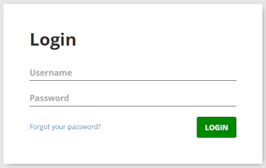

Je komt dan terecht op de homepagina van Studio. Hieronder zie je de homepagina van de Swing Studio-omgeving van provincies.incijfers.be:

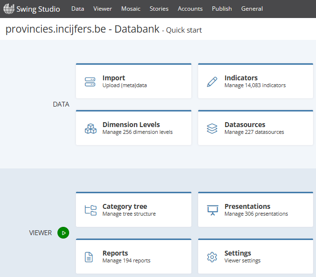

Hier zullen we achtereenvolgens op **Category tree**, **Indicators** en **Reports** klikken om de nodige lijsten te exporteren.

### Category tree

We beginnen met het exporteren van de themaboom zelf: de **Category tree**. Wanneer je op die knop klikt, krijg je de structuur van de themaboom te zien, waarbij je elk niveau kunt open- en dichtklappen. Bij provincies.incijfers.be ziet dit er als volgt uit:

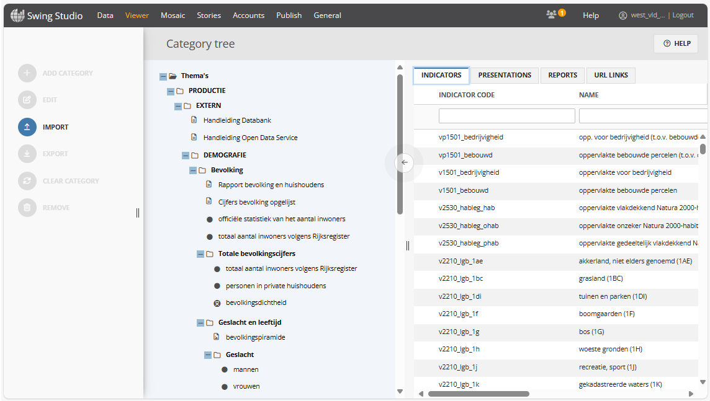

Hier vallen enkele dingen op: de externe themaboom van PinC (`EXTERN`) is een submap van `PRODUCTIE`, die op zijn beurt weer een submap is van `Thema's`. Die indeling is specifiek voor PinC. In de Swing-omgevingen van de steden en gemeenten kan dit anders zijn, en het is ook niet bij alle steden en gemeenten gelijk. Bij kortrijk.incijfers.be ziet het er bijvoorbeeld zo uit:

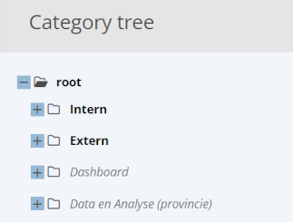

Het hoogste niveau (bij PinC: `Thema's`) is de **root**. Bij bijvoorbeeld Antwerpen heet de root eveneens `Thema's`, maar bij andere steden heet dit gewoon `root`.

Het thema daaronder (hier: `PRODUCTIE`) is optioneel. Bij de steden begint daar doorgaans de externe themaboom (die bij sommige steden `EXTERN` heet, bij andere `Extern` of zelfs iets heel anders). Niet alle steden hebben een externe en een interne themaboom; sommige hebben enkel één (externe) themaboom, en dan ontbreekt dit niveau.

Pas daarna volgen de thema’s en subthema’s die gebruikers te zien krijgen wanneer ze naar de databank gaan. Elk thema en subthema is weer een map op een dieper niveau. Binnen zo’n themamap zie je de verschillende onderwerpen staan. Behalve onderwerpen kunnen hier ook presentaties, rapporten en URL-links staan. Je ziet deze vier mogelijkheden op de vier tabs rechtsboven: `INDICATORS`, `PRESENTATIONS`, `REPORTS` en `URL LINKS`.

Om de themaboom te exporteren naar een Excel-bestand voor het Python-script, ga je als volgt te werk:

- selecteer de root door erop te klikken (bij Pinc: klik op `Thema's`)
- klik op `EXPORT` in het menu aan de linkerkant van het scherm

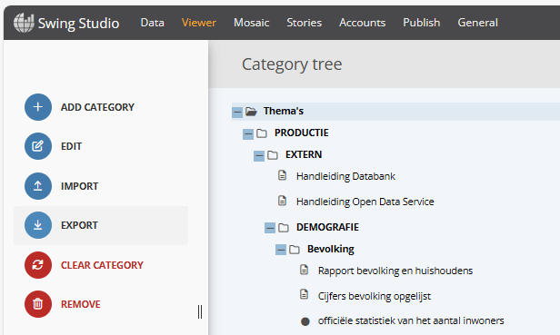

Hier kun je al bepalen welk deel van de themaboom het script precies zal tonen: selecteer je de root, dan wordt de complete inhoud van de themaboom geëxporteerd (dus zowel de externe als de interne en eventueel nog andere themabomen). Als je uitsluitend in de externe themaboom geïnteresseerd bent, dan selecteer je de map met de externe themaboom (bij PinC: `EXTERN`). Wanneer je vervolgens op `EXPORT` klikt, zal in dat geval alleen de externe themaboom geëxporteerd worden.

Klik je op `EXPORT` in het menu, dan krijg je nog onderstaand dialoogvenster waarin je ervoor kunt kiezen om alles te exporteren of alleen de map die je geselecteerd hebt. Na bevestigen met een klik op de groene `EXPORT`-knop maakt Studio een Excel-bestand aan met de themaboom. Dat bestand wordt door je browser gedownload en in je downloadmap geplaatst. Het bestand krijgt de naam `CategoryTree.xlsx`. Let op: wanneer er in je downloadmap al een bestand met die naam bestaat, dan krijgt het nieuw gedownloade bestand een andere naam, bv. `CategoryTree (1).xlsx`.

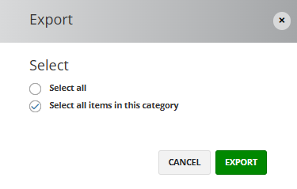

### Indicators

Het in de vorige stap gedownloade Excel-bestand bevat de structuur van de themaboom, met onder andere de codes van alle onderwerpen (indicatoren) die erin voorkomen. Het Python-script heeft niet enkel die codes nodig, maar ook de namen en de omschrijvingen van de onderwerpen. Daarom moeten we nu ook nog de lijst met indicatoren exporteren.

Dat gaat als volgt: ga terug naar de homepage van Studio en klik op de knop **Indicators**. Nu krijg je een lijst te zien van alle onderwerpen in de databank.

Klik op de knop `FILTER AND SORT` om eventuele filters van een vorige sessie te wissen en de volledige lijst te zien.

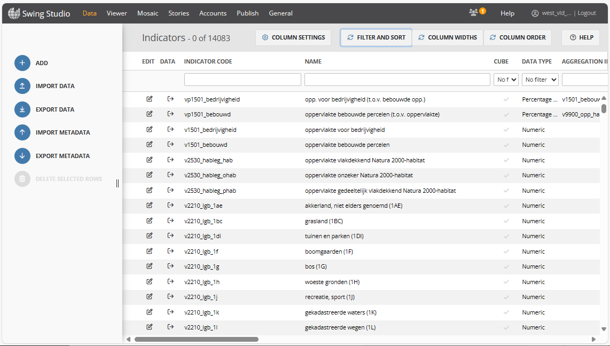

Om de lijst te exporteren, klik je op de knop `EXPORT METADATA`. Let op: klik _niet_ op `EXPORT DATA`, maar op `EXPORT METADATA`, anders wordt niet enkel de lijst van indicatoren geëxporteerd, maar alle data van alle onderwerpen! Dat is natuurlijk niet de bedoeling (en het zou ook erg lang duren, want je krijgt dan een heel groot bestand).

Klik je op `EXPORT METADATA` in het menu, dan krijg je nog onderstaand dialoogvenster te zien. Laat de geselecteerde opties aangevinkt staan. Na bevestigen met een klik op de groene `EXPORT`-knop maakt Studio een Excel-bestand aan met de lijst van onderwerpen. Dat bestand wordt door je browser gedownload en in je downloadmap geplaatst. Het bestand krijgt de naam `Indicators.xlsx`. Let op: wanneer er in je downloadmap al een bestand met die naam bestaat, dan krijgt het nieuw gedownloade bestand een andere naam, bv. `Indicators (1).xlsx`.

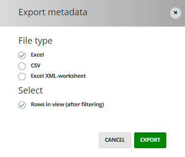

Het Python-script zal voor elke onderwerpcode die het aantreft in de themaboom, op zoek gaan naar de naam en de omschrijving van het betreffende onderwerp in de onderwerpenlijst. Het script kijkt ook naar het soort onderwerp (bv. is het een kubus? is het een percentage? is het een ratio? ...), om te bepalen welk pictogram er weergegeven moet worden vóór de naam van het onderwerp.

### Rapporten

In de themaboom staan echter niet alleen maar onderwerpen, er kunnen ook presentaties, rapporten en links naar andere webpagina’s in staan. In het geëxporteerde Excel-bestand (`CategoryTree.xlsx`) staan echter niet de namen van presentaties of rapporten en niet de links naar andere webpagina’s, maar een code die naar de betreffende presentaties, rapporten en links verwijst.

Om het Python-script de namen van de rapporten te laten weergeven, moet het script toegang hebben tot de lijst met rapporten. Ook die lijst kun je met Studio exporteren.

Daarvoor ga je als volgt te werk: ga terug naar de homepage van Studio en klik op de knop **Reports**. Nu krijg je een lijst te zien van alle klassieke rapporten (niet de Stories-rapporten).

Klik op de knop `FILTER AND SORT` om eventuele filters van een vorige sessie te wissen en de volledige lijst te zien.

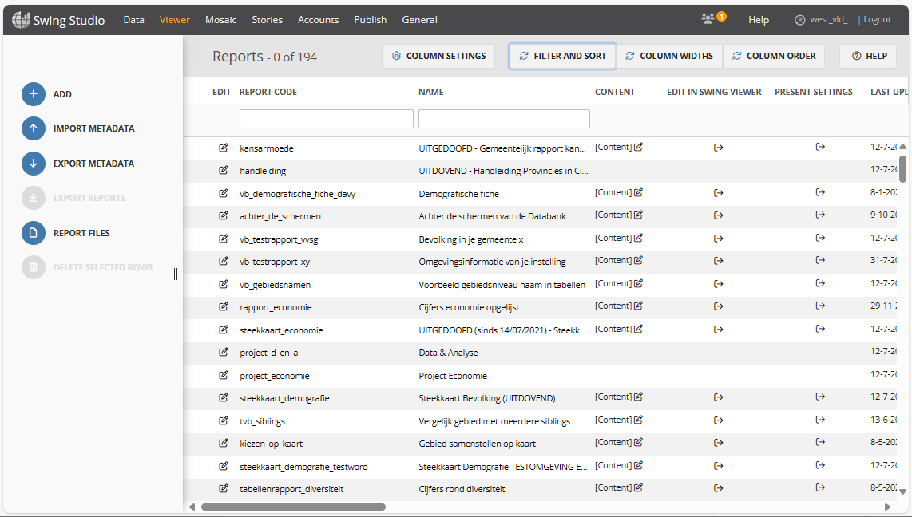

Om de lijst te exporteren, klik je op de knop `EXPORT METADATA` in het menu. Je krijgt dan weer hetzelfde dialoogvenster te zien als bij de export van de onderwerpenlijst. Laat de geselecteerde opties aangevinkt staan. Na bevestigen met een klik op de groene `EXPORT`-knop maakt Studio een Excel-bestand aan met de lijst van rapporten. Dat bestand wordt door je browser gedownload en in je downloadmap geplaatst. Het bestand krijgt de naam `Reports.xlsx`. Let op: wanneer er in je downloadmap al een bestand met die naam bestaat, dan krijgt het nieuw gedownloade bestand een andere naam, bv. `Reports (1).xlsx`.

### Presentations

Jammer genoeg is het niet mogelijk om de lijst met presentaties te exporteren. Op de homepage van Studio kun je wel op **Presentations** klikken en in de lijst van presentaties zie je wel `EXPORT METADATA` staan in het menu, maar als je daarop klikt, krijg je een foutmelding te zien en wordt er geen export gemaakt.

Daardoor heeft het Python-script geen toegang tot de naam van een presentatie. Bij presentaties in de themaboom zal het script daarom enkel de code van de presentatie kunnen weergeven. Het is wel een aanklikbare link die je naar de juiste presentatie in de databank zal brengen.

### URL-links

We kunnen ook de lijst met URL-links nog exporteren. Die vind je echter niet terug op de homepage van Studio. Je kunt er wel naartoe navigeren via het menu bovenaan: kies `Viewer` en vervolgens `Url links`. Je krijgt dan een lijst te zien met de URL-links.

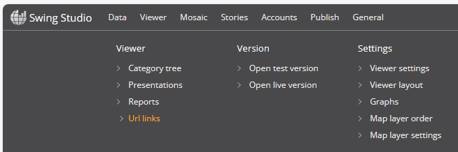

Klik op de knop `FILTER AND SORT` om eventuele filters van een vorige sessie te wissen en de volledige lijst te zien.

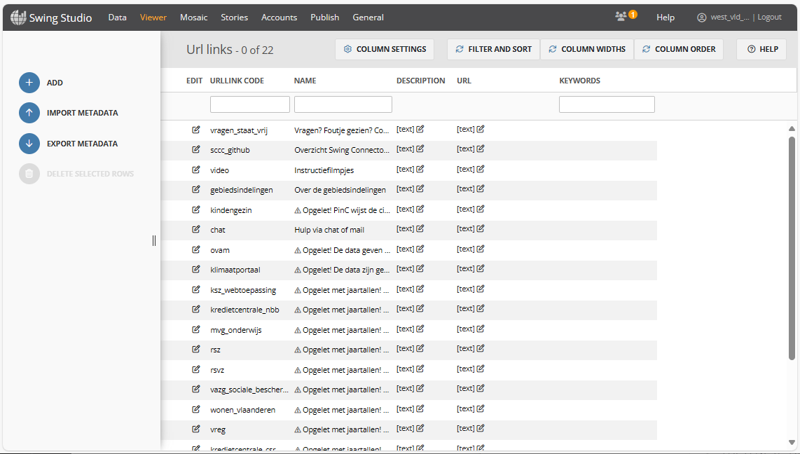

Om de lijst te exporteren, klik je op de knop `EXPORT METADATA` in het menu. Je krijgt dan weer hetzelfde dialoogvenster te zien als bij de export van de onderwerpenlijst. Laat de geselecteerde opties aangevinkt staan. Na bevestigen met een klik op de groene `EXPORT`-knop maakt Studio een Excel-bestand aan met de lijst van URL-links. Dat bestand wordt door je browser gedownload en in je downloadmap geplaatst. Het bestand krijgt de naam `Url_links.xlsx`. Let op: wanneer er in je downloadmap al een bestand met die naam bestaat, dan krijgt het nieuw gedownloade bestand een andere naam, bv. `Url_links (1).xlsx`.

## Het script runnen

Nu de nodige Excel-bestanden gedownload zijn, zijn we bijna klaar om het script te runnen.

Alvorens het script te starten, moet je alle zopas gedownloade Excel-bestanden nog verplaatsen van je downloadmap naar de map waar het Python-script staat, zodat het script de bestanden kan vinden. Zorg ervoor dat de bestanden de juiste naam hebben, dus bv. `CategoryTree.xlsx` en niet `CategoryTree (1).xlsx`.

Om het script te runnen, moet Python op je computer geïnstalleerd zijn. Hoe je Python installeert, valt buiten het bestek van deze handleiding. Zie je het zelf niet zitten, vraag dan hulp aan iemand die er ervaring mee heeft.

Het Python-script dat je nodig hebt, heet `swing_category_tree.py`. Het script kan gerund worden vanaf de commandoregel of met behulp van een Python-IDE (integrated development environment: software die je helpt om Python-scripts te schrijven, te runnen en te testen). Het script werd ontwikkeld met Python 3.9, dus met die versie van Python (of een recentere versie) moet het lukken.

Het script leest de geëxporteerde Excel-bestanden en bouwt aan de hand daarvan één of meerdere HTML-pagina’s met een volledig overzicht van de uitgeklapte themaboom. Heb je enkel de externe themaboom geëxporteerd, dan is het resultaat één HTML-bestand; heb je zowel de externe als de interne themaboom geëxporteerd, dan zal dit resulteren in twee aparte HTML-bestanden.

Behalve de hierboven genoemde Excel-bestanden gebruikt het script nog een bijkomend Excel-bestand, dat met het script wordt meegeleverd. Dat bestand heet `swing_sites.xlsx`. Het zorgt ervoor dat het script niet alleen goed werkt voor PinC, maar ook voor de Swing-omgevingen van de steden en gemeenten.

Het Excel-werkblad in `swing_sites.xlsx` bevat aparte rijen voor PinC en voor de centrumsteden, met informatie over de structuur van de themaboom, omdat die structuur niet voor alle Swing-implementaties dezelfde is.

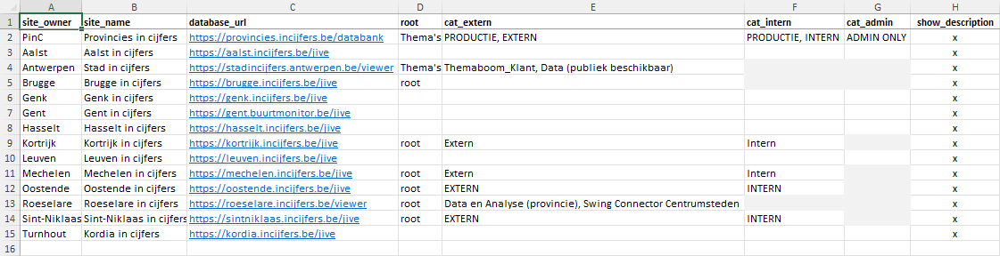

Zo zie je in de kolom `root` soms `Thema's` staan, soms `root`. De volgende drie kolommen geven aan hoe je vanuit de root bij de externe, de interne en de admin-themaboom komt. Bij PinC staat daar `PRODUCTIE, EXTERN` voor de externe themaboom, `PRODUCTIE, INTERN` voor de interne themaboom en `ADMIN ONLY` voor de admin-themaboom; bij de centrumsteden staat er `EXTERN`, `Extern` (of iets anders), etc., voor zover de centrumsteden ons hebben laten weten wat de structuur van hun themaboom is.

**Belangrijk:** om de themaboom voor jouw Swing-implementatie te maken, moet je **de rij voor jouw centrumstad naar boven verplaatsen**. Het script leest enkel de eerste rij van de tabel (onder de kolomtitels) en negeert al de rest. In het bestand dat met het script wordt meegeleverd, staat PinC op de eerste rij. Wil je de themaboom voor Kortrijk verwerken, verplaats dan de rij voor Kortrijk naar boven, zodat het script de juiste gegevens leest.

In de kolom `database_url` staat de basis-URL naar de databank. Wijzig dit niet, dit zou normaal gezien correct ingevuld moeten zijn voor alle centrumsteden.

Zie je dat er voor jouw stad nog niets ingevuld staat in de kolommen `root` en `cat_extern`, ga dan na wat de naam is van de root-map en van de map met de externe themaboom voor jouw Swing-omgeving, en vul dit aan in het Excel-bestand. Het zou sympathiek zijn als je het ons (PinC) ook laat weten.

Tenslotte is er nog een kolom `show_description`. Wanneer hier een `x` staat, zal het script in het resulterende HTML-bestand niet enkel de naam van elk onderwerp, maar ook de beschrijving mee opnemen. Wil je dat niet, dan maak je deze cel gewoon leeg (verwijder de `x`).

### HTML-bestand

Tijdens de run verschijnen op het scherm alle onderwerpen die aan de beurt komen. Na afloop toont het script de naam van het gegenereerde HTML-bestand. Dat bestand vind je in de map waar het script staat. Je kunt het bestand openen met je webbrowser (sleep het bestand vanuit de Verkenner naar je webbrowser of gebruik in je browser de sneltoets Ctrl+O en navigeer naar het bestand om het te openen).

Om alles zo goed mogelijk weer te geven, gebruikt het HTML-bestand hetzelfde lettertype als Swing. Swing gebruikt eigen lettertypen waar alle pictogrammen in zitten die in de themaboom worden gebruikt: de symbolen voor een plat onderwerp, een kubusonderwerp, een percentage, een ratio, een gemiddelde, etc. Die lettertypen zijn normaal gezien niet op jouw computer geïnstalleerd, en je hoeft ze ook niet te installeren. Ze worden meegeleverd in de map `fonts` en worden rechtstreeks door het HTML-bestand aangeroepen via CSS. (Er wordt ook een CSS-bestand meegeleverd: `swing_category_tree.css`.)

Wanneer je het HTML-bestand bekijkt met je webbrowser, zie je de uitgeklapte themaboom. Alle thema’s, subthema’s, onderwerpen, rapporten etc. zijn aanklikbare links die je direct naar de Swing-databank van jouw Swing-implementatie brengen. Test even of dit werkt.

Wanneer je deze uitgeklapte themaboom aan iemand anders wilt bezorgen, dan kun je best een PDF maken. In een PDF blijven alle aanklikbare links behouden en de lettertypen worden ingesloten, zodat anderen de correcte pictogrammen zullen zien.

Stuur het HTML-bestand _niet_ door naar anderen: lettertype en CSS-opmaak zullen in dat geval ontbreken (tenzij je ook het CSS-bestand en de lettertypen mee stuurt, maar dat is nogal omslachtig – het is veel handiger om gewoon een PDF-bestand te maken).

### Uitgedoofde en gearchiveerde items

Het script zal uitdovende, uitgedoofde en gearchiveerde items speciaal markeren in het HTML-bestand: ze krijgen een rode achtergrond, zodat je aandacht er onmiddellijk op gevestigd wordt. Het kan geen kwaad dat deze items in een interne themaboom staan (die gewone gebruikers nooit te zien krijgen), maar ze mogen beslist niet voorkomen in een externe themaboom. Zie je items met een rode achtergrond in de externe themaboom, dan is het tijd om actie te ondernemen!

### PDF maken

Je kunt eenvoudig een PDF-bestand maken vanuit je webbrowser: sla het bestand op als PDF via Afdrukken > Opslaan als PDF. Mogelijks moet je eerst nog enkele instellingen aanpassen, zoals pagina-formaat (A4), schaal, marges, achtergrondillustraties, geen kop- en voetregels. In ons HTML-bestand zitten geen achtergrondillustraties, maar de optie ‘achtergrondillustraties’ (of ‘achtergrondbeelden’) moet wel aangevinkt zijn als je de juiste (achtergrond)kleuren in het PDF-bestand wilt zien (opvallend rood voor uitdovende, uitgedoofde en gearchiveerde onderwerpen).

N.B.: maak geen gebruik van de virtuele printer ‘Microsoft Print to PDF’. Daarmee duurt het veel langer om een PDF-bestand te maken, en bovendien is het resulterende PDF-bestand van bedenkelijke kwaliteit en bevat het geen aanklikbare links! De ingebouwde PDF-writer van moderne webbrowsers is véél efficiënter!

Een voorbeeld van een dergelijk PDF-bestand vind je hier: [voorbeeld_themaboom.pdf](python/voorbeeld_themaboom.pdf). Het bestand bevat de eerste tien pagina’s van de externe themaboom van PinC, gemaakt op 19 maart 2025.
